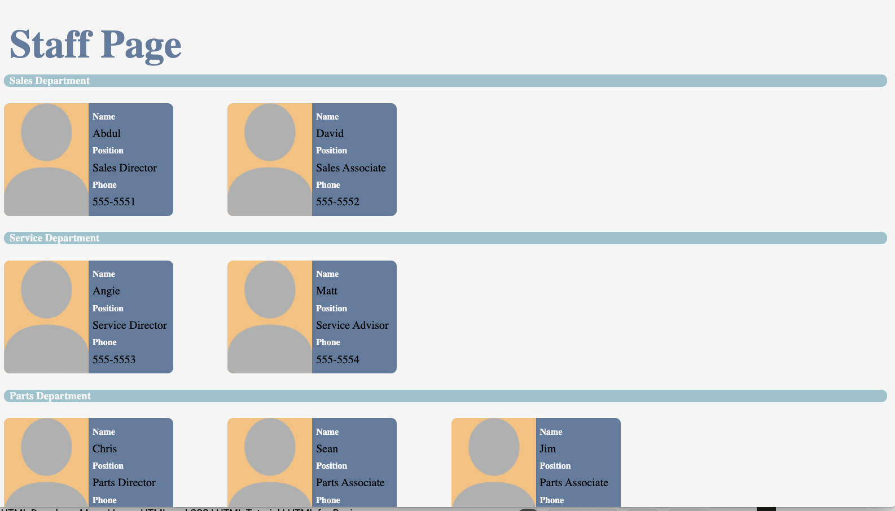

  # Exercise 1  
 
***

  ## Table of Contents

  * [Description](#description)
  * [Contributors](#contributors)
  * [Contact Information](#email)
***
 
  ## Description

    Assessment 1 of 3 for CallBox. Create A Staff Page using only HTML and CSS. There were four different staff departments provided, as well as 1-3 emplyees for each department. Using HTML and CSS grids I created a basic fromework. I then styled it using more pure CSS into a "card" format to make it a little easier on the eye. 
***

  ## Contributors

     Jon Misner, based on a Call Box asseessment prompt
  
***
  ## Contact Information

     Github: JonMisner
     Email: jonmisner86@gmail.com

